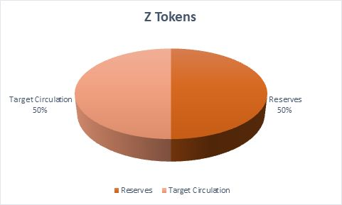

# TOKENS BREAKDOWN

<figure><figcaption></figcaption></figure>

50% of the total supply or 2,000,000,000,000,000 tokens are allocated to the reserve. These reserves tokens are used to burn an equivalent number of tokens that is sold during various stages of platform sale. Moreover, these tokens will be used for the purpose of replenishing the burnt tokens.

Tokens will be offered for sale in each phase as per the market scenarios and subsequently listed in an exchange platform.

Copyright © 2023 by Zebacus. All Rights Reserved.
